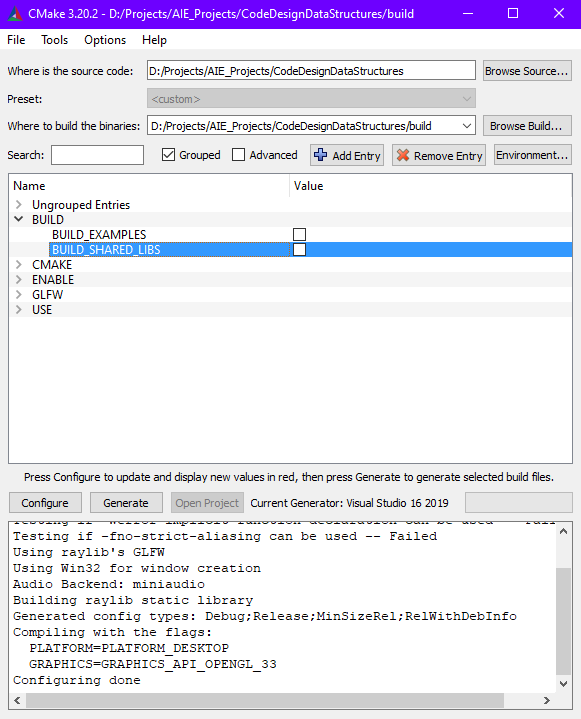
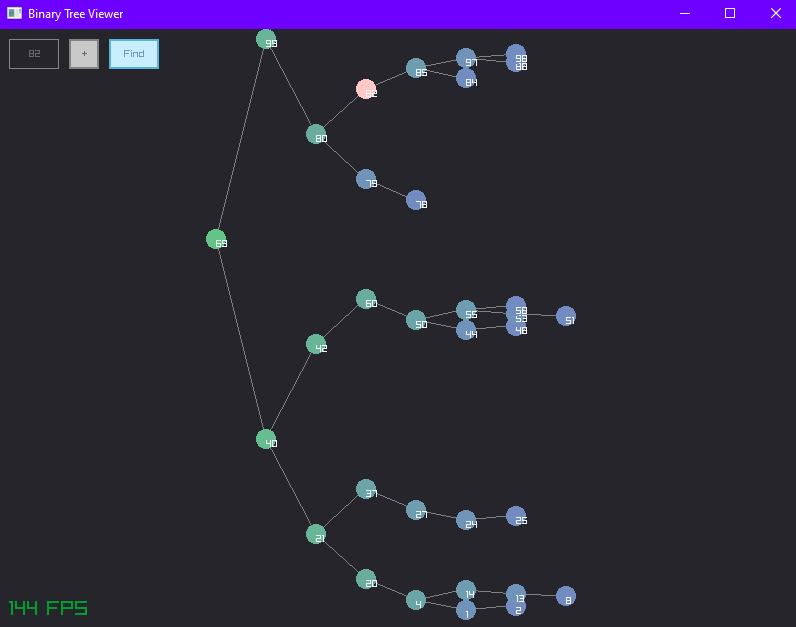

# Code Design & Data Structures
Lewis Comstive (s210314)
*AIE Code Design &amp; Data Structures Unit 2021*

# Setup
## Git
When cloning the git repository, make sure to include the `--recursive` flag to
download submodules at the same time.

`git clone --recursive https://../Code-Design-Data-Structures.git`

## CMake
Make sure that `BUILD_SHARED_LIBS` is disabled.

# Projects
## Data Structures
A header-only library that replicates select C++ standard-template-library structures.

## Binary Tree Viewer
Visual representation of a binary tree

## Inter-Process Communication
Example of using shared memory between two applications.

## Music Player
A simple music application to showcase double-linked-lists and hashtables.

## Dino Game
*Chrome dinosaur game* ripoff made with Raylib with simple collisions, physics and entity-component-system.

> Note: No end-game, very unfinished. Good luck.

# License
Check the [LICENSE](./LICENSE) for copyright